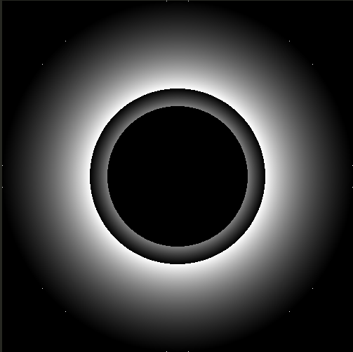

# IGS9-Shader-generativo


## Introducción
Esta práctica consiste en el diseño de un **shader generativo de fragmentos** que crea un efecto de **túnel circular discontinuo de colores**, con sensación de profundidad y movimiento.

El shader se ha desarrollado y ejecutado en: http://editor.thebookofshaders.com  


Como inspiración únicamente conceptual se tomó el siguiente shader de Shadertoy: https://www.shadertoy.com/view/tdjfDR.

## Motivación

La motivación principal de este shader fue crear una versión propia de un shader similar al del Shadertoy enlazado arriba, pero en una versión más sencilla, que ocupe menos de 512 bytes (tiny).

El shader de Shadertoy se tomó únicamente como referencia visual y conceptual del tipo de efecto que se quería conseguir, desarrollando la solución desde cero.

Además, se buscó deliberadamente construir el efecto a partir de operaciones matemáticas simples.


## Trabajo realizado para construir el shader

### Sistema de coordenadas

A partir de `gl_FragCoord.xy` se construye un sistema de coordenadas centrado y corregido por proporción de aspecto:

1. Normalización:
    ```
   vec2 fragCoord    = gl_FragCoord.xy;
   vec2 uvNormalized = fragCoord / u_resolution;
    ```

2. Centrado en el origen:
    ```
   vec2 coordsCentered = uvNormalized * 2.0 - 1.0;
    ```

3. Corrección del aspect ratio:
    ```
   float aspectRatio = u_resolution.x / u_resolution.y;
   coordsCentered.x *= aspectRatio;
    ```

Con esto el centro de la pantalla es (0,0) y el túnel mantiene forma circular aunque la pantalla no fuese de dimensiones cuadradas.

### Radio, ángulo y espacio polar

Sobre `coordsCentered` se calculan:
```
float radius = length(coordsCentered);
float angle  = atan(coordsCentered.y, coordsCentered.x);
float angleNorm = (angle + PI) / (2.0 * PI); 
```

- `radius` se usa posteriormente para la sensación de profundidad, y es la distancia del pixel al punto (0,0), como creamos un túnel circular centrado en el origen, podría considerarse su radio.
- `angleNorm` se usa para definir el color del círculo, es el ángulo del pixel respecto al punto (0,0), normalizado para obtener valores entre 0 y 1.

### Profundidad y bandas animadas

Para crear la sensación de que el túnel tiene profundidad y de que “avanzamos” a través de él, el shader utiliza estos tres pasos:

```
float speed = 2.0;
float depth = speed * u_time + 4.0 / (radius + 0.002);
float bands = mod(depth, 1.0);
```

**1. Velocidad del efecto**

``` 
float speed = 2.0;
```

`speed` controla lo rápido que cambia el patrón en función del tiempo (`u_time`).  
Si se aumenta este valor, las bandas se desplazan más deprisa; si se reduce, el movimiento es más lento, se fijó el valor a 2.


**2. Cálculo de la “profundidad”**

``` 
float depth = speed * u_time + 4.0 / (radius + 0.002);
``` 

Aquí se combinan dos componentes:

- `speed * u_time`  
  Es un valor que crece con el tiempo, debido a u_time, por lo que hace que el patrón tenga movimiento.

- `4.0 / (radius + 0.002)`  
  Introduce la dependencia con la distancia al centro:
  - `radius` es la distancia al punto (0,0).  
    - Cerca del centro, `radius` es pequeño por consiguiente, el término `4.0 / (radius + 0.002)` es grande.  
    - En los bordes, `radius` es mayor lo que implica que el término es más pequeño.
  - El `+ 0.002` evita dividir exactamente entre cero y suaviza el comportamiento en la zona central.
  - El factor `4.0` controla cuánto influye el radio: valores más altos concentran más las bandas cerca del centro, se fueron poniendo valores a mano hasta encontrar un resultado satisfactorio, de la misma manera que se hizo con el 0.002.

En conjunto, `depth` mezcla **tiempo** y **distancia al centro**:
- El tiempo desplaza globalmente el patrón.
- El radio hace que el efecto varíe según lo cerca o lejos que está cada píxel del centro, simulando la profundidad.


**3. Generación de las bandas**

```
float bands = mod(depth, 1.0);
```

`bands` se queda solo con la parte fraccionaria de `depth`, es decir, siempre toma valores entre `0.0` y `1.0`. Esto consigue:

- Que el patrón sea **periódico**: aunque `depth` crece sin límite con el tiempo, `bands` se repite cíclicamente.
- Que aparezcan **anillos (bandas) concéntricos**:  
  al variar `depth` con el tiempo y con el radio, las zonas donde `bands` toma valores altos o bajos se van desplazando, formando las franjas que se ven moverse hacia el centro.

Después, este valor se utiliza para modular el color:

```
finalColor = hueColor * bands;
```

- `hueColor` define el tono del píxel (en función del ángulo), como se ve en el siguiente apartado.
- `bands` decide si ese píxel está en una zona brillante u oscura del túnel.

La combinación de ambos es lo que genera el efecto de túnel de color con bandas animadas.

### Color generativo
El color se construye en función del ángulo normalizado entre 0 y 1, teniendo cuidado para que nunca supere los límites en los canales de color:

```
vec3 hueColor = vec3(
    angleNorm,
    1.0 - angleNorm,
    0.5 + 0.5 * angleNorm
);

vec3 finalColor = hueColor * bands;
```

- El ángulo define el tono alrededor del círculo.
- Las bandas controlan la intensidad y la estructura del túnel.


## Proceso de diseño

1. **Versión base en escala de grises**  
   - Normalización y centrado de coordenadas.  
   - Corrección de aspect ratio.  
   - Uso de `1.0 / (radius + c)` y `mod` para obtener anillos concéntricos.  

2. **Animación con tiempo**  
   - Introducción de `u_time` en el cálculo de `depth`.  
   - Ajuste de la velocidad y de los factores del término `1.0 / radius`.  
   - Resultado: bandas que parecen desplazarse hacia el centro del túnel.

3. **Color por ángulo**  
   - Cálculo de `angleNorm` en [0,1].  
   - Construcción de un `vec3` sencillo a partir de `angleNorm`.  
   - Multiplicación por `bands` para combinar color y profundidad.

4. **Limpieza y versión final**  
   - Eliminación de `if` innecesarios (el resultado me pareció mejor sin ellos).   
   - Obtención de una versión tiny desde la legible.

## Shaders intermedios interesantes

Antes de llegar al punto 2, se estuvo probando el cálculo del ángulo y distintas formas de generar profundidad, aunque en este shader el color todavía no dependía del ángulo, se obtuvo este curioso resultado que parece un "ojo".

    #ifdef GL_ES
    precision mediump float;
    #endif

    #define PI 3.14159265359

    uniform vec2 u_resolution; 

    void main() {

        vec2 fragCoord = gl_FragCoord.xy;

        vec2 uvNormalized = fragCoord / u_resolution;

        vec2 coordsCentered = uvNormalized * 2.0 - 1.0;

        float aspectRatio = u_resolution.x / u_resolution.y;
        coordsCentered.x *= aspectRatio;
        
        vec2 coordsForColor = coordsCentered * 0.5 + 0.5;

        vec3 finalColor = vec3(0.0);
        if (length(coordsCentered) < 1.0){
            float angle = atan(coordsCentered.y,coordsCentered.x );
            float depth = 1.0/(length(coordsCentered) + 0.0001);
            angle = (angle + PI) / (2.0 * PI);
            if (length(coordsCentered) > 0.40){
                finalColor = vec3(mod(depth,1.0), mod(depth,1.0),mod(depth,1.0));
            }
        }
        

        gl_FragColor = vec4(finalColor, 1.0);
    }





Una vez se consiguió crear el efecto túnel antes de añadir los colores se hizo en escala de grises quedando esta versión intermedia:

    #ifdef GL_ES
    precision mediump float;
    #endif

    #define PI 3.14159265359

    uniform vec2  u_resolution;  
    uniform float u_time;       

    void main() {

        vec2 fragCoord = gl_FragCoord.xy;

        vec2 uvNormalized = fragCoord / u_resolution;

        vec2 coordsCentered = uvNormalized * 2.0 - 1.0;

        float aspectRatio = u_resolution.x / u_resolution.y;
        coordsCentered.x *= aspectRatio;

        float radius = length(coordsCentered);

        vec3 finalColor = vec3(0.0);


        if (radius < 1.0) {

        
            float angle = atan(coordsCentered.y, coordsCentered.x);
            float angleNorm = (angle + PI) / (2.0 * PI);   

            float speed = 1.0;
            
            float depth = u_time * speed + 3.0 / (radius + 0.2);

            float bands = fract(depth); 

            if (radius > 0.20) {
                finalColor = vec3(bands);  
            }
        }
        
        gl_FragColor = vec4(finalColor, 1.0);
    }


## Shader final

En esta versión aparte de añadir que el color dependa del ángulo, también se quitaron los condicionales de la versión en escala de grises, debido a que se considera que se obtiene un mejor resultado de esta forma.


    #ifdef GL_ES
    precision mediump float;
    #endif

    #define PI 3.14159265359

    uniform vec2  u_resolution;  
    uniform float u_time;        

    void main() {

        vec2 fragCoord = gl_FragCoord.xy;

        vec2 uvNormalized = fragCoord / u_resolution;

        vec2 coordsCentered = uvNormalized * 2.0 - 1.0;

        float aspectRatio = u_resolution.x / u_resolution.y;
        coordsCentered.x *= aspectRatio;

        float radius = length(coordsCentered);

        vec3 finalColor = vec3(0.0);

        
            
            float angle = atan(coordsCentered.y, coordsCentered.x);
            
            float angleNorm = (angle + PI) / (2.0 * PI);  

            float speed = 2.0;
            float depth = speed * u_time + 4.0 / (radius + 0.002);
            float bands = mod(depth, 1.0);  

        

            vec3 hueColor = vec3(
                angleNorm, 
                1.0 - angleNorm, 
                0.5 + 0.5 * angleNorm
            );

            finalColor = hueColor * bands;
            
        
        
        gl_FragColor = vec4(finalColor, 1.0);
    }


## Versión tiny

Versión compacta que cumple la restricción de ocupar menos de 512 bytes, ocupando únicamente 409 bytes:

    #ifdef GL_ES
    precision mediump float;
    #endif
    #define PI 3.14159265359
    uniform vec2 u_resolution;
    uniform float u_time;
    void main(){
        vec2 p=gl_FragCoord.xy/u_resolution*2.-1.;
        p.x*=u_resolution.x/u_resolution.y;
        float r=length(p),a=atan(p.y,p.x);
        float t=(a+PI)/(2.*PI);
        float d=2.*u_time+4./(r+.002);
        float b=mod(d,1.);
        vec3 c=vec3(t,1.-t,.5+.5*t)*b;
        gl_FragColor=vec4(c,1.);
    }

Tanto la versión tiny como la ampliada, muestran el mismo resultado:


## Uso de IA

En esta práctica se ha utilizado una IA para:

- Obtener una versión compacta (*tiny*) a partir del shader legible.
- Revisión de la ortografía en este README.md


## Referencias

- Apuntes de la práctica de la asignatura IG: https://github.com/otsedom/otsedom.github.io/tree/main/IG/S9
- The Book of Shaders: https://thebookofshaders.com
- Shader de referencia visual en Shadertoy: https://www.shadertoy.com/view/tdjfDR